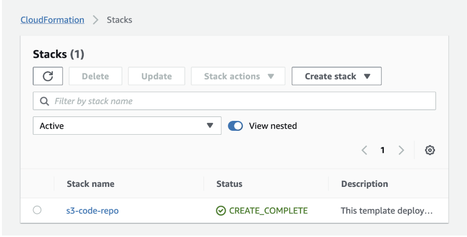
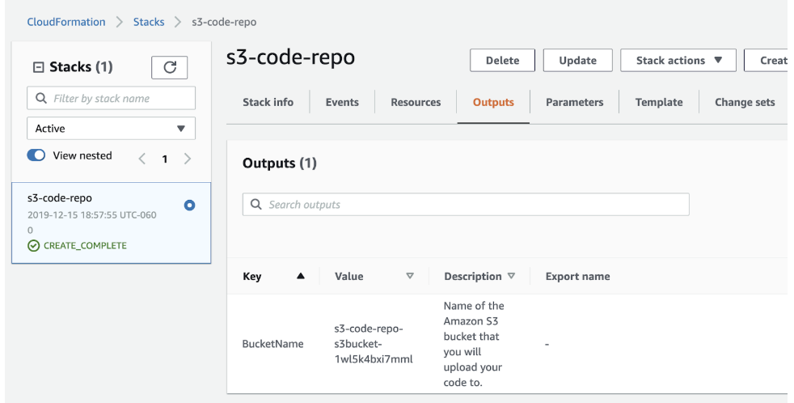
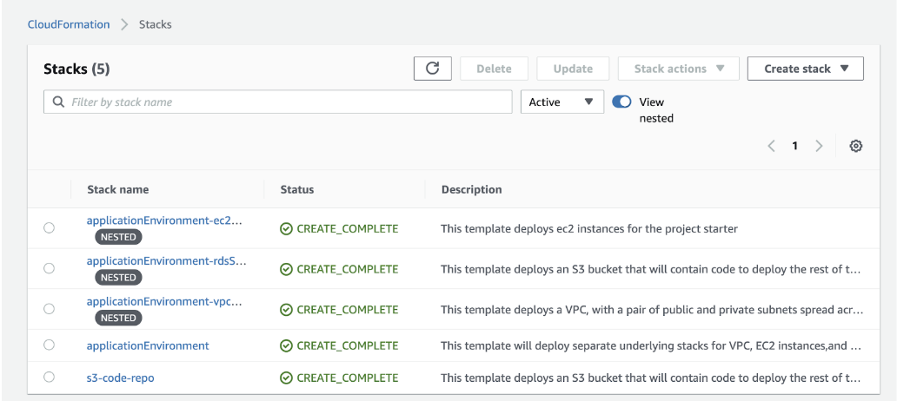
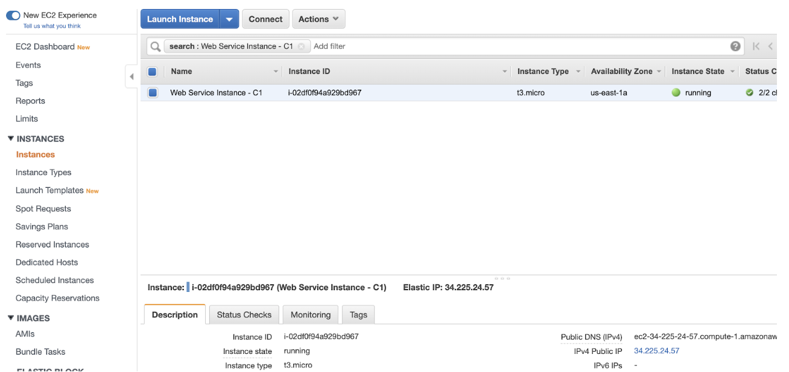
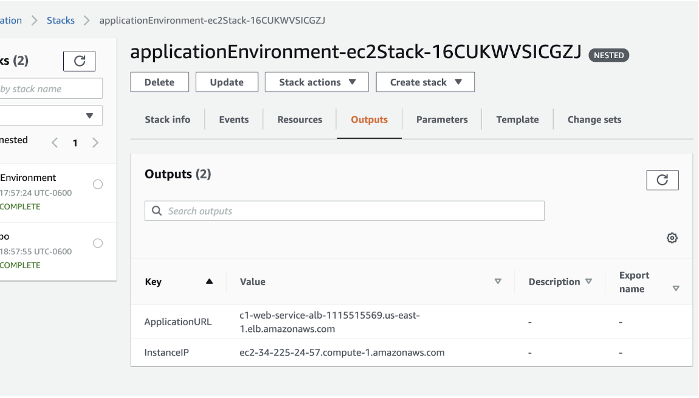
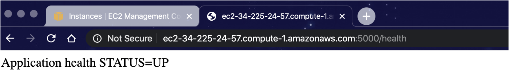
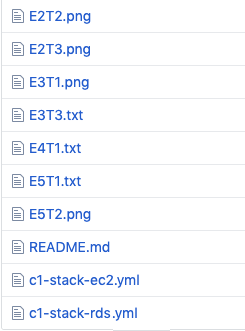

# Deploy a Highly Available Web Service in AWS.

In this project, you will:

* Design and deploy a fault tolerant and resilient web service architecture.
* Monitor availability, simulate and test failure scenarios and recovery.
* Finally, you will create a reference architecture that will encompass the concepts used in the project.

## Dependancies and Prerequisites

### Access to AWS account  
Students will need to use their personal AWS accounts.  Udacity will provide a $100 credit for any usage costs. If project instructions are followed we do not anticipate usage costs to exceed this amount.

### Installation of the AWS CLI and Local Setup of AWS API keys
Instructions and examples in this project will make use of the AWS CLI in order to automate and reduce time and complexity.
Refer to the below links to get the AWS CLI installed and configured in your local environment.

[Installing the CL](https://docs.aws.amazon.com/cli/latest/userguide/install-cliv1.html)

[Configuring the CLI](https://docs.aws.amazon.com/cli/latest/userguide/cli-chap-configure.html)

### Local setup of git and GitHub Repository
You will need to clone / fork / download this GitHub repo in order to work on and submit this project.

### Access to a Diagramming Tool
Some suggested diagramming tools are draw.io or lucidchart.com. If you prefer, you can start from scratch and use your own tools and submit the diagram as an image.

## Exercise 1 - Deploy Web Service Application Infrastructure

**_Deliverables for Exercise 1:_**
* _There are no deliverables for Exercise 1._

### Task 1:  Review Architecture Diagram
In this task, the objective is to familiarize yourself with the starting architecture diagram. An architecture diagram has been provided which reflects the resources that will be deployed in your AWS account.

The diagram file can be found in the _starter_ directory in this repo.

You may open the “AWS-WebServiceDiagram-v1-noHA.drawio” file in **draw.io** or import the diagram into **lucidchart.com** as a starting point for the architecture portion of this project. 

**You will be updating your architecture diagram as you change your environment.** The instructions will tell you when you need to update your diagram.

**Note:** the starter environment architecture diagram is also available to view in this document as an image.

### Task 2: Review CloudFormation Template
In this task, the objective is to get you up and running quickly - we have provided a CloudFormation template which will deploy the following resources in AWS:

* A VPC with 2 public subnets, one in each availability zone.
* An instance that will be running a simple web service.
* An RDS database that will be queried by the web service application.

Spend a few minutes going through the .yml files in the _starter_ folder to get a feel for how parts of the code will map to the components in the architecture diagram.

## Task 3: Deployment of Initial Infrastructure
In this task, the objective is to deploy the cloudformation stack that will create the below environment.


This is a starting point environment which does _not_ have redundancy or fault tolerance.  It has the basic components needed to make the application work.

We will utilize the AWS CLI in this guide, however you are welcome to use the AWS console to deploy the CloudFormation template.


1. From the root directory of the repository - execute the below command to deploy the template.
```
aws cloudformation create-stack --region us-east-1 --stack-name s3-code-repo --template-body file://starter/c1-s3code.yml
```

Expected example output:
```
{
    "StackId": "arn:aws:cloudformation:us-east-1:4363053XXXXXX:stack/s3-code-repo/70dfd370-2118-11ea-aea4-12d607a4fd1c"
}
```

Expected example AWS Console status: https://console.aws.amazon.com/cloudformation/home?region=us-east-1#/stacks



2. Once you see Status is CREATE_COMPLETE, determine the name of the S3 bucket by navigating to the Outputs section of the stack:



3. Upload the code to the S3 bucket that has been created by typing this command into the console (you will replace bucket value with your bucket value):
 
Example:  `aws s3 cp . s3://s3-code-repo-s3bucket-1wl5k4bxi7mml/ --recursive --region us-east-1`

4. Deploy the stack. This will create all the resources for the application environment. In the following command, we are referencing the created S3 bucket in this command
```
aws cloudformation create-stack --region us-east-1 --stack-name applicationEnvironment --template-url https://s3.amazonaws.com/s3-code-repo-s3bucket-1wl5k4bxi7mml/c1-stack-top.yml
```

Expected response:
```
{
    "StackId": "arn:aws:cloudformation:us-east-1:43630XXXXXX:stack/applicationEnvironment/b4efb170-2127-11ea-b56d-0a531bfc577e"
}
```

5. Check the console for completion - allow 10-20 minutes.



6. Take a look at the resources that have been deployed by going to the console for EC2 and RDS.  



7. You will need the Application Load Balancer endpoint to test the web service.  You can get this from the Outputs section of the **applicationEnvironment-ec2** stack.



## Task 4: Testing the Web Service

In this task, the objective is to verify the application availability by running the curl command or by loading the following URL into your browser. We will use this throughout the project to verify the health and availability of the application.

_http://<application load balancer dns name>/health_

You should see the following response returned by the API call.



## Exercise 2: Monitoring for Availability and Testing Failure

Now that you have a successfully deployed and running environment,  you need some visibility into the health of your application and infrastructure.

To achieve this you will set up Route53 Health Check and CloudWatch dashboards that will display key metrics.

_**Deliverables for Exercise 2:**
* **Task 2:** A screenshot called E2T2.png which shows Endpoint Health and Load Balancer & Infrastructure Metrics.
* **Task 3:** A screenshot called E2T3.png which shows how the dashboards illustrate failures and outages.

### Task 1: Monitor Endpoint Health
In this task, the objective is to set up a Route53 health check that will simulate an external user making a request to our application.

1. From the AWS console - go to the [Route 53 service HealthChecks page](https://console.aws.amazon.com/route53/healthchecks/home?region=us-east-1#/).

2. Create a health check for the application web service:
..a. Name:  C1-WebService-HealthCheck
..b. Specify Endpoint By:  Select Domain Name
..c. Domain Name:  Copy and paste the Application URL  DNS name from the end of Exercise 1
..d. Path: Enter the word health
..e. Expand the Advanced Configuration Section
..f. Select String Matching: Select Yes
..g. Search String: Enter **Application health STATUS=UP**
..h. Hit **Next**, and **Do not setup an Alarm**. 
..i. Create the Health Check

See an Example below.


### Task 2: Dashboard for Application Health

In this task, the objective is to create a dashboard that will provide visibility into the application’s overall health and responsiveness including insight into:

* Client requests that will be sent from the load balancer to the application server
* Load balancer target groups and status of underlying server instances
* Overall status of the web service endpoint

Using the AWS console, create a dashboard with key metrics using CloudWatch

You can [create dashboards here](https://console.aws.amazon.com/cloudwatch/home?region=us-east-1#dashboards).

1. Give your dashboard a name.
2. Add widgets that contain the following metrics:
..a. **Route53**: HealthCheckStatus
..b. **Application Load Balancer**:  RequestCount and HTTP_Code_Target_2xx
..c. **Application Load Balancer**: HealthHost Count and UnHealthyHost Count
3. Save your dashboard.
4. Submit a screenshot of the final dashboard. Call it E2T2.png.

### Task 3: Failure Simulation 1 - Instance Failure
In this task, the objective is to force a failure by shutting down the application server instance and observe the impact on availability.

1. Use the AWS CLI to shut down the application instance.  You can obtain the instance ID from the console.
Example command:
```
aws ec2 stop-instances --instance-ids i-02df0f94a929bd967

```
2. Go back to the dashboard that you had created in Task 2.  After a few minutes you will notice changes indicating that the service is no longer up.
3. Bring the application back up by starting the instance back up:
Example command: 
```
aws ec2 start-instances --instance-ids i-02df0f94a929bd967
```
4. Submit a screenshot of the final dashboard which shows the failure and recovery. Call it E2T3.png.

## Exercise 3: Add Redundancy and Fault Tolerance
We initially deployed our environment with a single applications server node and a single AZ database.  
The VPC that we deployed actually has a second subnet in a secondary availability zone.

We initially deployed our environment with a single application server node and a single AZ database.
The VPC that we deployed actually has a second subnet in a secondary availability zone.

**_Deliverables for Exercise 3:_**
* **Task 1:** Update the Architecture Diagram (you will update it again in Exercise 5).
* **Task 3:** A text file called E3T3.txt with cost estimates.

#### Task 1 - Update the architecture Design and Diagram
In this task, the objective is to update to the initial architecture design. You must make changes to the diagram so that it will have a secondary application server node and a database server that can handle any outages occurring at the physical location where they are running (availability zone). 

Make sure to show these changes in your diagram:
* Additional subnets and availability zones
* Additional application server instances
* Load balancing of client requests to multiple instances
* Multi-AZ RDS Database replication and redundancy

#### Task 2 - Update Code and Deploy Redundancy Capabilities
In this task, the objective is to deploy changes to the environment. You must make changes to the environment so that it has a secondary application server node and a database server that can handle an outages occurring at the physical location where they are running (availability zone).

1. Update stack template code to add an additional EC2 instance behind the application load balancer. Add the following resource to c1-stack-ec2.yml after the AppInstance clause on line 67.

```
# Add code for Exercise 3
    AppInstance2:
      Type: AWS::EC2::Instance
      Properties:
        ImageId: !Ref AmiId
        InstanceType: t3.micro
        SecurityGroupIds:
        - !GetAtt WebAppSG.GroupId
        SubnetId: !Ref SubnetId2
        Tags:
        - Key: "Name"
          Value: "Web Service Instance 2 - C1"
        UserData:
          Fn::Base64: !Sub |
            #!/bin/bash
            echo "Environment=DB_HOST="${DbHost} | sudo tee -a /lib/systemd/system/flask.service
            echo "Environment=DB_USER="${DbUser} | sudo tee -a /lib/systemd/system/flask.service
            echo "Environment=DB_PASSWORD="${DbPassword} | sudo tee -a /lib/systemd/system/flask.service
            systemctl daemon-reload
            sleep 30
            service flask restart
```

2. Update the stack using the AWS CLI:
```
aws cloudformation update-stack --region us-east-1 --stack-name s3-code-repo --template-body file://starter/c1-stack-ec2.yml
```

Expected example output:
```
{
    "StackId": "arn:aws:cloudformation:us-east-1:4363053XXXXXX:stack/xxxx/70dfd370-2118-11ea-aea4-12d607a4fd1c"
}
```
3. Use the console to verify that the stack has been updated.  See Exercise 1, Task 3 for a similar example.
4. Update the RDS database code template to modify the RDS database to be running in Multi-AZ mode. 
Modify the following code for the MultiAZ property in c1-stack-rds.yml:
```
MYSQLDB:
    Type: AWS::RDS::DBInstance
    Properties:
      AllocatedStorage: 20
      DBInstanceClass: db.t2.micro
      DBInstanceIdentifier: c1-rds-mysql
      DBSubnetGroupName: !Ref DBSubnetGroup
      DBName: product
      Engine: MySQL
      EngineVersion: 5.7.26
      MasterUsername: admin
      MasterUserPassword: jerky1999
      MultiAZ: True   # change to true for Multi-AZ
      VPCSecurityGroups:
      - !Ref DBIngressSG
```
5. Update the stack using the AWS CLI:
```
aws cloudformation update-stack --region us-east-1 --stack-name s3-code-repo --template-body file://starter/c1-stack-ec2.yml
```

Expected Example Output:
```
{
    "StackId": "arn:aws:cloudformation:us-east-1:4363053XXXXXX:stack/xxxx/70dfd370-2118-11ea-aea4-12d607a4fd1c"
}
```
6. Use the console to verify that the stack has been updated.  See Exercise 1, Task 3 for a similar example.

### Task 3 - Determine Additional Usage Costs
In this task, the objective is to provide a break down of additional (before and after) monthly costs for the changes that were made.

You will provide the cost estimates in file E3T3.txt under the following headings:
```
# Single instance, Single AZ RDS DB environment usage cost
RDS:
EC2 instances:
EC2 Application Load Balancer:
Total:
# 2 Instances, Multi-AZ RDS DB environment usage cost:
RDS:
EC2 instances:
EC2 Application Load Balancer:
Total:
```
---
**Tips:** Explore pricing pages and the AWS cost calculator for the services that we are using.
AWS cost calculators:
* https://calculator.aws/#/
* https://calculator.s3.amazonaws.com/index.html
EC2 Pricing:
* https://aws.amazon.com/ec2/pricing/on-demand/
RDS Pricing:
* https://aws.amazon.com/rds/mysql/pricing/
Application Load Balancer Pricing:
* https://aws.amazon.com/elasticloadbalancing/pricing/


## Exercise 4 - Availability zone outage.

Now it’s time to see if the fault tolerance we have added will improve the availability of our environment.

**_Deliverables for Exercise 4:_**
* **Task 1:** In a text file called E4T1.txt you will write out changes you have observed after simulating an outage.
* (Optional) **Stand Out Suggestion:** In a text file called E4SO.txt document strategies to allow for quicker detection of an issue and automated remediation. 

### Task 1: Simulate an outage by running the following commands 
In this task, the objective is to run the following commands to simulate a scenario. In this scenario, multiple components and network connectivity within a physical availability zone are undergoing failure.

1. Use the AWS CLI to shut down the application instance and restart the DB (causing a failover).  You can obtain the EC2 instance ID and the RDS instance name from the console.
Example command:
```
aws ec2 stop-instances --instance-ids i-02df0f94a929bd967
```
```
aws rds reboot-db-instance  --db-instance-identifier c1-rds-mysql
```
 
2. Go back to the Application Health dashboard.  Wait 5 minutes for the dashboards to refresh.
3. Observe the changes and document the results via file E4T1.txt:
```
# List the metrics that changed in your dashboard
 
# which metrics would indicate that external customer requests are impacted?
 
# Did the application become unavailable?  Provide an explanation for your answer.
 
# Estimate the amount of time that the application was down.

```
4. Restore the environment to full capacity by starting the instance back up:
Example command: 
```
aws ec2 start-instances --instance-ids i-02df0f94a929bd96
```
### Stand Out Suggestion: Self Healing
Research strategies to allow for quicker detection of an issue and automated remediation.

You may document these strategies in E3SO.txt:
```
# Identify 1-2 changes to monitoring that would allow our dashboards to detect an outage quicker.

# Describe two AWS capabilities which would allow our environment to recover from a component failure automatically (without intervention).  Hint:  One of these capabilities is included in the high availability version of our environment.
```

## Exercise 5: Backups and Disaster Recovery

Thus far you have experimented with failures or loss of individual components and observed how availability is impacted.

In some cases it is critical to plan for larger scale outages of AWS services or regions which would cause our entire environment be down without the ability to recover the existing environment.

In this scenario we would need to ensure that data and servers are being backed up or replicated to a separate region.

It is your task to choose a strategy and architect the infrastructure in order to ensure that the environment can be restored to a separate region.

**_Deliverables for Exercise 5:_**
* **Task 1:** In a text file called E5T1.txt you will write out your design documentation.
* **Task 2:** You will submit your final update of the Architecture Diagram. You will submit this as E5T2.[file extension].

### Task 1: Design Documentation
In this task, the objective is to create design documentation. For your highly available, multi-region architecture, you will provide a brief outline for how you will ensure that your application can be backed up and recovered to a different region.

Submit documentation to E5T1.txt with the following details:
```
# Overview of the problem statement
# Executive summary of the solution
# Your objective is to ensure that the same version of the application can be launched in a secondary DR environment.  Describe the method you will use to achieve this goal.
# The business requires that a copy of the data will need to be available to use in a secondary DR environment. Describe the method you will use to achieve this goal. 
# Describe the design you will use to deploy your environment to a secondary region (e.g. warm standby, pilot light, active-active, etc). 
# In the event of a full outage to the primary environment, the business wants to be able to bring the secondary environment online as quickly as possible.  Identify the approach that will be used to stand up or recover the environment in the secondary region.
# The business would like to know the anticipated availability in “9’s” for the primary environment.  Provide a calculation for this metric including assumptions made.
# Estimate recovery time objective (RTO) - Hint - break down the estimated time for each phase of an outage, e.g: Outage detection and triage, time to bring up the new environment, time to validate and switch traffic over.
# Estimate recovery point objective (RPO) - Worst case scenario, how old the restored data will be once the environment is restored.
# Estimate the monthly costs of the DR environment be sure to include, usage costs for running the DR environment, changes made to the primary environment to facilitate DR (e.g. cost for enabling backups, replication, etc)
```

### Stand Out Suggestion
For each of the decision points in your design, present alternative methods or design choices and provide justification for your choice based on business requirements, best practices, or your own professional experience.  Include these additional details as a separate sub section under each heading in E5T1.txt


### Task 2: Update the Architecture Diagram
In this task, the objective is to update the architecture to reflect your chosen strategy.  

Take a screenshot or export the diagram as an image or PDF for submission. Call it E5T2.[file extension].

The updated diagram should clearly illustrate:
* AWS regions and availability zones
* Infrastructure components (EC2 instances, load balancers, RDS database instances and replicas)
* Data flow: type of traffic, where is it coming from, where is it going (include client request traffic, data replication, backups or snapshots)
* Status of components (i.e. gray out components which are shut down or in standby mode)

## Required Screenshots and File Uploads:



## Built With

* AWS Cloudformation templates
* AWS CLI and bash scripts
* Python flask web service
* MySQL database (RDS)
* draw.io architecture design diagram

## License

This project is licensed under the MIT License - see the [LICENSE.md]()
